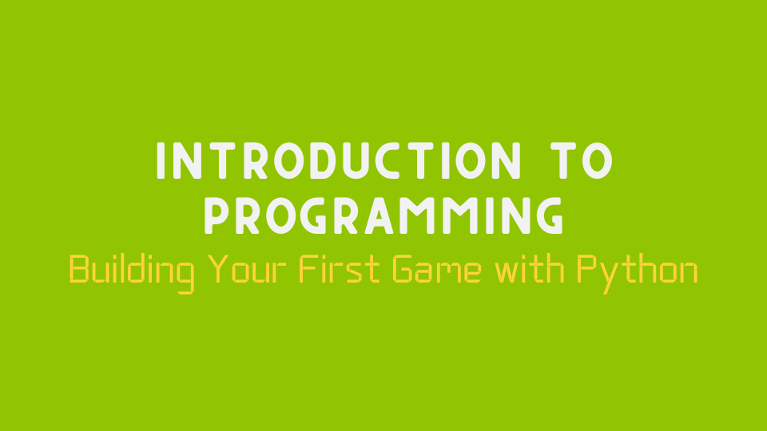

# [Introduction to Programming : Building Your First Game with Python](https://py.codervai.com/)

A basic programming course for absolute beginners to get into the world of programming. In this course you will learn the basics of Programming and learn different libraries of Python. And finally you will build 2 Classic Games using PyGame library and last of all there will be a Final Assignment where you will be building a new game on your own.

Visit the Course: [py.codervai.com](https://py.codervai.com/)